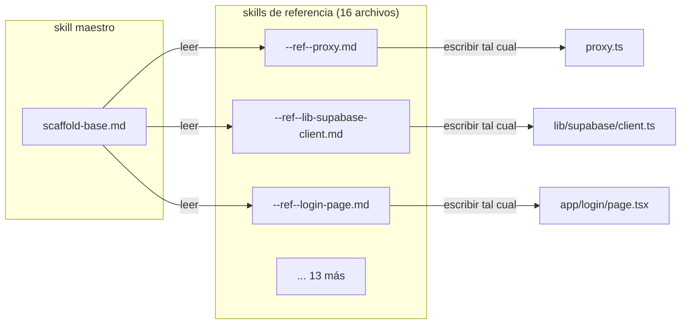
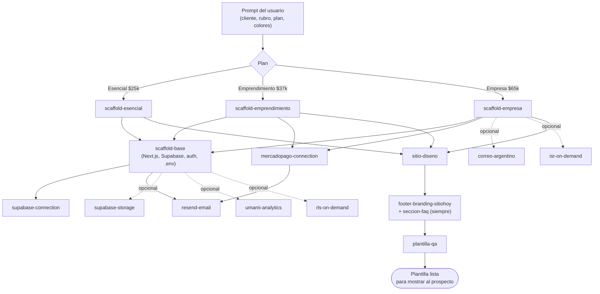

<div align="center">

# 🏗️ Scaffold Skills

**Skills de Claude orquestados que generan sitios web completos, listos para vender**

[](https://nextjs.org/)
[](https://www.typescriptlang.org/)
[](https://supabase.com/)
[](https://tailwindcss.com/)
[-D97757?logo=anthropic&logoColor=white)](https://www.anthropic.com/)
[]()

Un solo prompt con los datos de un cliente entra por un lado, y del otro sale un sitio
Next.js multi-tenant completo — scaffold, integraciones, diseño único y QA — sin
escribir una línea de código a mano.

</div>

---

Librería de **skills orquestados para Claude** que genera, de punta a punta, sitios web
demo para prospectos de un negocio de plantillas web: scaffold técnico
(Next.js + Supabase multi-tenant), diseño visual único por plantilla, integraciones
(pagos, email, storage, analytics, envíos) y un paso de QA automático antes de mostrar
el resultado a un cliente.

No es una librería de código que se importa. Es un **conjunto de instrucciones en
Markdown** que Claude lee, encadena y ejecuta con sus propias herramientas (crear
archivos, correr `npm`, leer y escribir código). El "código" del proyecto son los
`.md` de `skills/`; el resultado son proyectos Next.js completos.

---

## Qué hace

A partir de un solo prompt con los datos de un cliente (nombre, rubro, plan, WhatsApp,
colores), el sistema:

1. Crea un proyecto Next.js + TypeScript + Tailwind desde cero.
2. Configura Supabase multi-tenant (auth, RLS, storage), Resend para emails y,
   según el plan, Mercado Pago, cupones, envíos y analytics.
3. Diseña la UI completa con libertad creativa (cada plantilla tiene que ser
   visualmente distinta a las anteriores — no hay un layout fijo que se repita).
4. Corre un checklist de QA (build, responsive, datos de muestra, diversidad visual)
   y corrige lo que encuentra roto.

Al final, el prospecto puede abrir `npm run dev` y ver una plantilla llena, animada y
funcional — sin que nadie haya escrito una línea de código a mano.

---

## Cómo funciona la orquestación

Cada skill es un archivo `.md` con frontmatter (`name` + `description`). La
`description` es lo que usa el modelo para decidir **cuándo** cargar ese skill —
funciona igual que el matching semántico de Claude Skills, pero resuelto por prompt
en vez de por un runtime de skills nativo.

Hay dos tipos de archivo en `skills/`:

- **Skills maestros** (`scaffold-esencial.md`, `sitio-diseno.md`, …): el flujo,
  paso a paso, en lenguaje natural. Deciden qué preguntar, en qué orden generar
  cosas, y a qué otros skills llamar.
- **Skills de referencia** (`scaffold-base--ref--proxy.md`,
  `sitio-diseno--ref--colores.md`, …): contenido literal — código, SQL, copy — que
  el skill maestro copia **verbatim** al proyecto, cambiando solo placeholders
  explícitos (`{NOMBRE_CLIENTE}`, `{TENANT_ID}`).

La convención de nombre `<skill>--ref--<recurso>.md` es la que reemplaza a las
carpetas anidadas: como todo vive en una sola carpeta plana (`skills/`), el prefijo
funciona como namespace. Un skill maestro nunca ejecuta código de otro directamente:
le indica a Claude, en su propio texto, qué archivo `--ref--` leer y en qué path del
proyecto destino escribirlo.



### Mapa completo del flujo



---

## Mapa de skills

| Skill | Capa | Cuándo actúa |
|---|---|---|
| `scaffold-base` | Base técnica | Siempre, primer paso de los 3 scaffolds de plan |
| `scaffold-esencial` | Plan | Catálogo, contacto, WhatsApp — sin carrito ni pagos |
| `scaffold-emprendimiento` | Plan | + carrito, checkout, cupones, envíos por zonas fijas |
| `scaffold-empresa` | Plan | + productos ilimitados, Envia.com o Correo Argentino, analítica avanzada |
| `sitio-diseno` | Diseño | Después del scaffold — diseño visual único, seed data, copy del rubro |
| `plantilla-qa` | QA | Después del diseño — build, responsive, datos de muestra, anti-repetitividad |
| `footer-branding-sitiohoy` | Transversal | Siempre — franja de marca de la plataforma en el footer, en todos los planes |
| `seccion-faq` | Transversal | Siempre — sección de FAQ en la Home, diseño libre por plantilla |
| `supabase-connection` | Integración | Conexión y esquema de Supabase |
| `supabase-storage` | Integración | Subida/gestión de imágenes de producto |
| `resend-email` | Integración | Emails transaccionales (contacto, confirmación de pago) |
| `mercadopago-connection` | Integración | Pagos — por defecto en Emprendimiento y Empresa |
| `rls-on-demand` | Integración | Políticas Row Level Security de Supabase por plan |
| `isr-on-demand` | Integración | Revalidación de caché on-demand multitenant |
| `umami-analytics` | Integración | Analytics, eventos diferenciados por plan |
| `correo-argentino` | Integración | Envíos vía MiCorreo — opcional, por defecto en Empresa |

Debajo de los 16 skills maestros hay **61 archivos `--ref--`** con el contenido
literal (código, SQL, copy) que cada uno copia al proyecto generado.

> Los planes, precios y qué integración corresponde a cada uno reflejan la
> configuración actual de esta librería, no una regla fija del sistema. Cada skill
> maestro define en su propio texto qué plan lo activa (por ejemplo,
> `mercadopago-connection` se invoca desde `scaffold-emprendimiento` y
> `scaffold-empresa`) — alcanza con editar esa condición en el skill correspondiente
> para adaptar precios, planes o qué integraciones van en cada uno a otro modelo de
> negocio.

---

## Estructura necesaria

Todo lo que hace falta para usar la librería es tener la carpeta `skills/` accesible
para Claude:

```
tu-carpeta-de-trabajo/
└── skills/
    ├── scaffold-base.md
    ├── scaffold-base--ref--proxy.md
    ├── scaffold-base--ref--lib-supabase-client.md
    ├── scaffold-base--ref--...              (16 refs)
    ├── scaffold-esencial.md
    ├── scaffold-esencial--ref--...
    ├── scaffold-emprendimiento.md
    ├── scaffold-empresa.md
    ├── sitio-diseno.md
    ├── sitio-diseno--ref--...                (15 refs)
    ├── plantilla-qa.md
    └── ...
```

No hay `package.json`, no hay build, no hay dependencias que instalar para la
librería en sí — es texto plano. Las dependencias (Next.js, Supabase, Tailwind,
Mercado Pago, etc.) las instala cada skill **dentro del proyecto que genera**, no
en este repo.

> A diferencia del sistema nativo de Skills de Claude Code (una carpeta
> `.claude/skills/<nombre>/SKILL.md` por skill), esta librería vive como archivos
> planos en `skills/` para poder reutilizarse tal cual tanto en Claude Code como
> pegada al Knowledge de un Proyecto de claude.ai. La navegación la resuelve el
> propio modelo leyendo los archivos por nombre — no depende de un runtime de
> skills específico.

---

## Instalación

### Requisitos

- [Claude Code](https://claude.com/claude-code) (o cualquier cliente de Claude con
  acceso a archivos y a una terminal — es lo que permite correr `npx create-next-app`,
  `npm install`, etc.)
- Node.js 18+ y npm
- Una cuenta de [Supabase](https://supabase.com) (el proyecto generado es multi-tenant)
- Una cuenta de [Resend](https://resend.com) (emails transaccionales)
- Mercado Pago (por defecto en Emprendimiento / Empresa)
- Opcional: Umami Cloud (analytics), Envia.com o MiCorreo (envíos, por defecto en Empresa)

### Opción A — Claude Code (recomendada)

```bash
git clone <url-de-este-repo> sitiohoy-skills
cd sitiohoy-skills
claude
```

Con Claude Code parado en esta carpeta (o en cualquier carpeta que tenga `skills/`
como subcarpeta), simplemente describí lo que necesitás en el prompt — Claude
encuentra el skill correcto por su `description` y sigue el flujo. No hace falta
instalar ni registrar nada más.

### Opción B — Knowledge de un Proyecto de claude.ai

Subí todo el contenido de `skills/` (los 77 archivos, sin subcarpetas) como
Knowledge de un Proyecto. Sirve para diseñar, planificar o revisar copy sin tocar
el sistema de archivos, pero como estos skills terminan generando un proyecto
Next.js real en disco, para el scaffold completo conviene Claude Code.

---

## Cómo probarlo

### Prompt inicial de ejemplo

Con eso alcanza para que el flujo completo (scaffold → integraciones → diseño → QA)
corra solo, preguntando lo que le falte:

```
Quiero generar una plantilla demo nueva con estos skills (carpeta skills/).

- Cliente: Panadería La Espiga
- Slug: panaderia-la-espiga
- Rubro: panadería artesanal de barrio
- Plan: Emprendimiento
- WhatsApp: +54 9 11 5555-5555
- Dominio final: panaderialaespiga.com.ar
- Colores: elegí vos algo cálido y artesanal, mostrame 2-3 opciones

Corré el flujo completo: scaffold del plan (que arma la base, Supabase, Resend,
Mercado Pago, cupones y envíos por zona), después el diseño visual, y por último
el QA. Al final quiero poder correr `npm run dev` y ver la plantilla lista para
mostrarle a un prospecto.
```

Claude va a ir preguntando lo que cada skill necesite y no esté en el prompt (tenant
ID, mood visual, etc.), avisando en qué paso está.

### Verificar el resultado

```bash
cd panaderia-la-espiga
npm run dev
```

Abrí `http://localhost:3000` — la Home, el catálogo y el checkout deberían verse
completos con datos de muestra e imágenes, sin necesidad de tocar nada ni de tener
Supabase configurado todavía (el propio `plantilla-qa` verifica que haya mock data
para este caso).

---

## Extender la librería

Un skill nuevo es un `.md` en `skills/` con este frontmatter:

```markdown
---
name: nombre-del-skill
description: Una sola oración densa — es lo que el modelo usa para decidir cuándo
  cargar este skill. Tiene que dejar claro qué genera y en qué momento del flujo
  se invoca (solo o desde qué otro skill).
---
```

Si el skill necesita contenido literal para copiar a un proyecto (código, SQL,
copy), va en un archivo aparte con el prefijo del skill dueño:
`nombre-del-skill--ref--que-genera.md`. El skill maestro referencia ese archivo
por nombre en su propio texto y le indica a Claude el path de destino.

---

## Nota sobre `PruebaPirmerPlantilla/`

Esa carpeta contiene sitios ya generados con estos skills, a modo de ejemplo de lo
que el sistema produce a partir de un prompt. No son parte de la librería — no hace
falta mirarlos ni tocarlos para usar `skills/`.

---

## Autor

Tomás Cerdeyra
